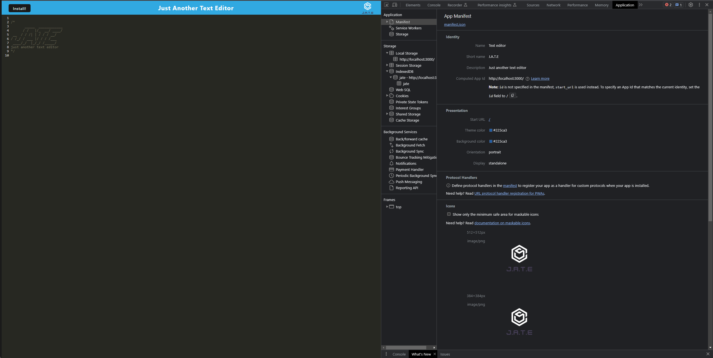
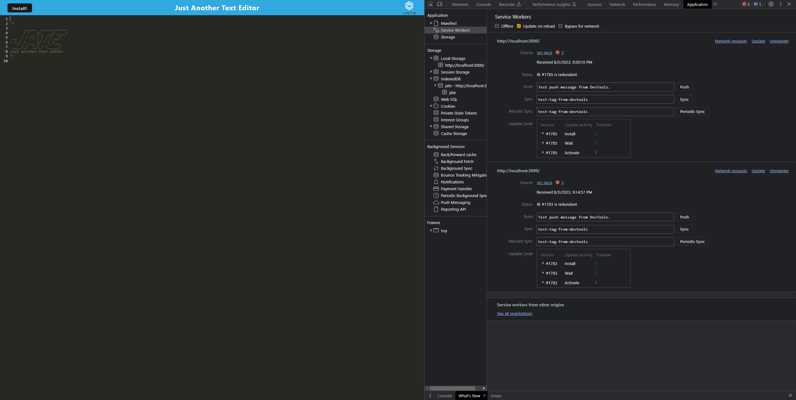
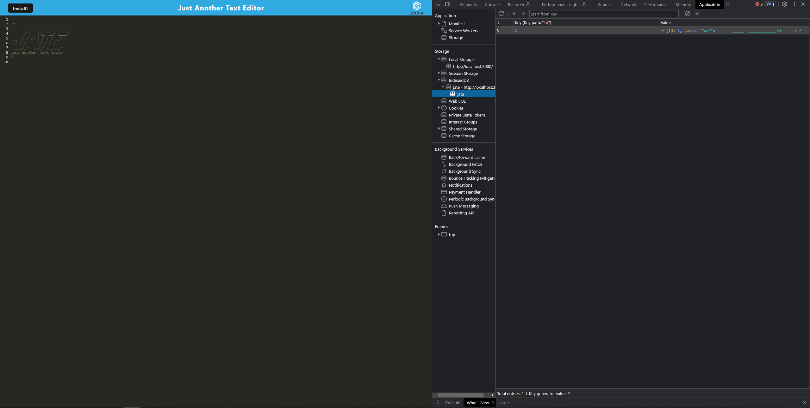

# Text Editor

  
  
  ## Table of Contents
  * [Description](#description)
  * [Installations](#installation)
  * [Usage](#usage)
  * [License](#license)
  * [Questions](#questions)

  ## Description
  This application is a text editor that is able to be used online and offline.
  
  
  

  ## Installation
  Run npm i inside your terminal to install the application.

  ## Usage
  Inside the root of the folder make sure you run npm run build. Once the build is over run npm run start.

  ## Licenses
    Your application is covered under MIT

  ## Questions
  * Github: https://github.com/baily-locatelli
  * Email: bailylocatelli@gmail.com
  * heroku: https://text-editor-pwa-bcs-8a2f9be88dc3.herokuapp.com/
  